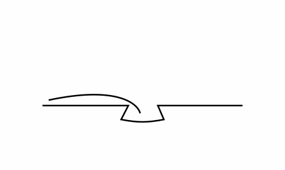

# 북끄북끄

> **중고 도서 거래 / 대여 및 추천 서비스**  

📽️ [시연 영상 바로가기](https://drive.google.com/file/d/1mJb7Dtvg7D853WkUg7NKR2r8eR2tngaM/view) 
📝 [회의록 보기]()

 

## 목차

🌱 북끄북끄 서비스 소개
 
⏰ 개발 기간
 
💡 기획 배경
 
🎯 목표 및 주요 기능
 
🔧 기능 소개
 
📢 기술 스택 소개
 
🔍 시스템 아키텍처
 
💾 ERD 다이어그램
 

 

### ⏰ 개발 기간 (6주)
2025.04.14 ~ 2025.04.30 (2주) 기획, 설계
 
2025.05.01 ~ 20.05.22 (4주) 개발

 

### 💡 기획 배경

- 읽고 싶은 책이 많지만, 굳이 사고 싶지는 않을 때
- 내가 소장한 책을 다른 사람과 교환하고 싶을 때
- 나에게 맞는 맟춤형 책을 추천받고 싶을 때

**중고 도서를 대여/교환할 수 있고 맞춤형 도서까지 추천해주는, 북끄북끄**

 

### 🎯 목표 및 주요 기능

본 서비스는 중고 도서를 교환함으로써 지식을 선순환하며 독서 문화를 활성화하고자 하는 목표를 가집니다.
 
위시리스트 기반의 실시간 도서 매칭과 추천 서비스를 통해 사용자 맞춤형 서비스를 제공합니다.
 
또한, 북끄지수로 사용자 간 신뢰도를 측정하며 실시간 채팅을 통해 대면 거래를 활성화합니다.
 
결과적으로 단순한 도서 교환 플랫폼을 넘어, 지식과 경험을 나누는 소통의 창구로써의 역할을 가집니다.

 

### 🔧 기능 소개

서비스의 주요 기능들을 소개합니다.

#### ✅ 카카오 로그인
카카오 로그인을 통해서 서비스에 접근할 수 있습니다. 

#### ✅ GPS 위치 설정
주변 이웃들과 매칭 될 수 있도도록 위치 정보를 저장합니다. GPS 기능을 사용해 현재 위치를 불러올 수 있습니다.

#### ✅ 책 등록
ISBN, 알라딘 책 검색, 직접 등록을 통해서 책을 등록할 수 있습니다. 

#### ✅ 나의 서재
등록한 도서들을 내 전체 서재 탭을 통해 확인할 수 있습니다. 등록한 도서 중 교환이 가능한 서재는 공개 처리 합니다. 공개된 책들은 내 공개 서재 탭을 통해 확인할 수 있습니다. 공개 서재는 다른 유저들이 볼 수 있습니다.
 

#### ✅ 매칭
공개 서재를 기반으로 매칭률 순, 거리 순 정렬를 통해 매칭된 이웃들을 둘러볼 수 있습니다.
이때, 매칭률은 **거래 후 상호 평가 점수(북끄 지수),거리,최근 활동성**을 종합하여 나타냅니다.

정렬을 사용해 매칭 목록 보기
 

 
매칭된 상대나, 주변 이웃 서재 보기를 통해 다른 사람들의 공개 서재를 볼 수 있습니다.
 

#### ✅ 읽고 싶은 책 추천
사용자의 위시리스트, 도서 검색 활동을 기반으로 맞춤형 도서 TOP5를 제공합니다.

 
실시간 인기 검색어, 검색어 자동완성 또한 같이 볼 수 있습니다.
 

 
사용자 경험 개선을 위해서 검색 시 오탈자 자동 보정으로 스마트 검색 기능을 구현하였습니다.
 

#### ✅ 채팅
매칭된 이웃과 도서를 교환 또는 거래하고 싶은 경우 채팅을 통해 연락할 수 있습니니다. 채팅에서는 사진 보내기, 일정 등록하기, 이모지 반응하기 기능을 제공합니다.

 
일정 등록 시 책 교환과 대여 모두 지원합니다. 일정 등록 모달에서 책 교환하기를 선택하면 캘린더를 통해 교환할 당일날 약속을 잡을 수 있습니다.책 대여하기를 선택하면 캘린더를 통해 대여할 시작일부터 반납일까지 약속을 잡을 수 있습니다.
 

 
거래 완료 후 매너 평가를 통해 북끄 지수가 산출됩니다. 평가 시 거래 한 도서를 등록하면, 거래 도서가 내 서재에 자동 등록 됩니다.
 

#### ✅ 독서 기록
등록한 도서로 가장 인상적이였던 인용구와 독후감을 남길 수 있습니다. 인용구 별자리 탭에서는 인용구들이 별처럼 밤하늘에 펼쳐진 모습을 볼 수 있습니다.

  
책의 여정 탭에서 짧게 독서 후기를 남기고, 다른 사람들과 책 후기를 나눌 수 있습니다. 책의 여정에서도 후기를 남긴 책의 여정들을 3D 시각화 하여 볼 수 있습니다.

#### ✅ 거래 기록

마이페이지에서 거래 약속 보기 탭을 통해 현재 거래 약속을 볼 수 있습니다. 또한, 거래 기록 탭을 통해 총 거래한 기록을 확인할 수 있습니다.

#### ✅ 알림

매칭된 이웃, 채팅, 거래 전 확인 알림 등 알림을 통해 정보를 확인할 수 있습니다.

 

### 📢 기술 스택 소개

#### Frontend

#### Backend 

#### Build & Deployment

#### Database & Cache

#### Infrastructure

### 🔍 시스템 아키텍처

 

### 💾 ERD Diagram

 

### 👥 팀 소개 및 역할

버뮤다 삼각김밥 팀입니다!

| Frontend | Frontend | Frontend | Backend | Backend | Backend |
|--------------|--------------|--------------|--------------|----------|--------------|
| 순화 👑 | 민재 | 다혜 | 수비 | 정민 | 인혁 |

